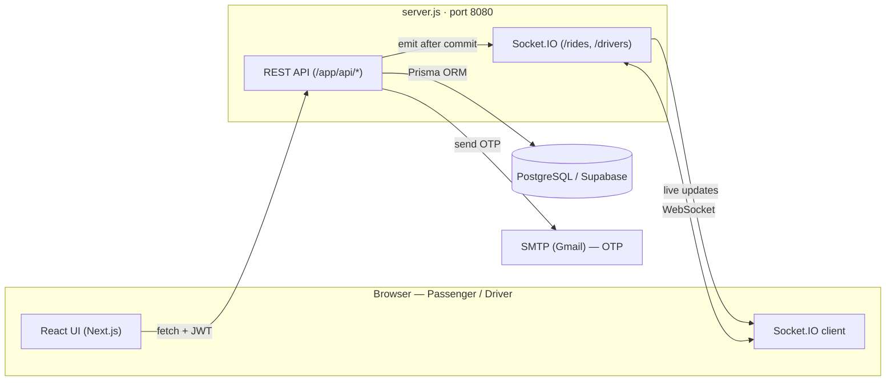
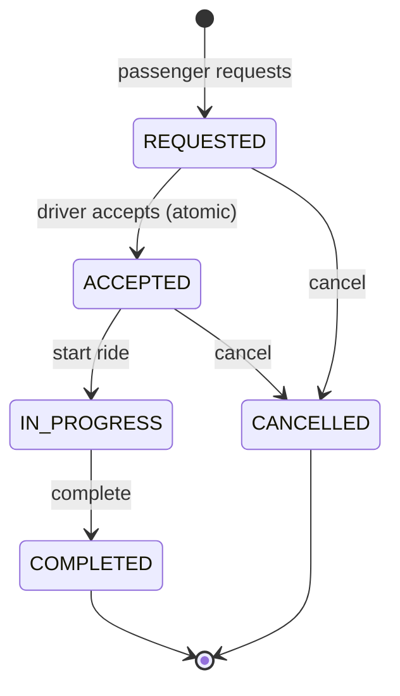

# Campus Ride Platform

A **real-time campus mobility platform** connecting passengers and drivers
(modelled on IIT Roorkee's e-rickshaw last-mile transport). Passengers request
rides, drivers accept and manage them, and every update is delivered **live** over
WebSockets — no refresh needed.

### Live Demo
**https://real-time-campus-mobility-platform-production.up.railway.app**

Demo accounts (password `password123`):
| Role | Email |
|---|---|
| Passenger | `passenger@example.com` |
| Driver | `driver@example.com` |

> Tip: to see real-time in action, open two windows — one normal (passenger) and
> one Incognito (driver). Take the driver online, request a ride as the passenger,
> and watch it appear and update live on both sides.

---

## Project Overview

The platform solves fragmented, informal campus transport with a single
coordinated system: secure auth, driver availability, a ride request → assignment
→ lifecycle workflow, live updates, dashboards, ratings, and analytics.

A **custom Node server** (`server.js`) hosts Next.js (UI + REST API) **and**
Socket.IO in one process, so API routes and the WebSocket layer share a runtime.
Every state change is **persisted first, then broadcast** — clients never receive
a non-durable update.



---

## Technology Stack

| Layer | Technology |
|---|---|
| Framework | Next.js 15 (App Router) + TypeScript (strict) |
| Real-time | Socket.IO (`/rides`, `/drivers` namespaces) |
| Database | PostgreSQL (Supabase) + Prisma ORM |
| Auth | JWT + bcryptjs, email OTP (Nodemailer) |
| Validation | Zod |
| UI | Tailwind CSS, Leaflet/OpenStreetMap, Recharts |
| Deploy | Docker on Railway / Render / Koyeb |

---

## Feature List

### Mandatory
- [x] JWT authentication with **email OTP verification**
- [x] Passenger & driver registration + profiles (driver vehicle info)
- [x] Driver availability (online/offline + live location)
- [x] Ride request workflow (pickup/drop, **distance-based fare**)
- [x] **Atomic** ride assignment — a ride goes to exactly one driver
- [x] Real-time updates (live requests, acceptance, status)
- [x] Ride lifecycle (state machine below)
- [x] Driver dashboard (total rides, earnings, rating, history)
- [x] Ratings & feedback (updates driver average)

### Optional / Bonus
- [x] Live map (Leaflet / OpenStreetMap)
- [x] Ride scheduling
- [x] Digital payments (UPI / Card / Wallet / Cash, simulated)
- [x] Demand analytics (peak hours, popular locations)
- [x] Demand forecasting (Moving Average + Exponential Smoothing)



---

## Project Structure — where everything lives

```
app/
  api/
    auth/        signup (OTP), login, send-otp
    rides/       create/list, [id] status, requests, ratings, scheduled
    drivers/     available, status (online/offline + location)
    payments/    initiate (simulated)
    analytics/   demand, forecast (ML)
  auth/          login + signup (OTP) pages
  dashboard/     passenger & driver dashboards
  request-ride/  booking flow (map, fare, live wait-for-driver)
  schedule-ride/ future-ride scheduling
  my-rides/      history + star ratings
  analytics/     demand charts      forecast/  ML predictions
  page.tsx       landing page       layout.tsx root layout + toasts
components/
  map/           RideMap (Leaflet)
  payments/      PaymentModal (UPI/QR/Card/Cash)
  common/        Cards, Toast, LoadingSpinner
lib/
  auth.ts        JWT + bcrypt helpers
  prisma.ts      Prisma singleton client
  socket.ts      server-side Socket.IO emit helpers
  useSocket.ts   client-side Socket.IO hook
  email.ts       OTP email (Nodemailer, console fallback)
  locations.ts   campus locations + Haversine + fare model
prisma/
  schema.prisma  7 models + enums + indexes
  seed.ts        demo users + historical rides (analytics data)
  migrations/    committed DB migrations
server.js        custom Next.js + Socket.IO server
Dockerfile       container build       render.yaml  Render blueprint
schema.dbml      ER diagram source (dbdiagram.io)
```

**Database:** 7 Prisma models — `User`, `PassengerProfile`, `DriverProfile`,
`SavedLocation`, `Ride`, `Rating`, `EmailVerification`. Import `schema.dbml` into
[dbdiagram.io](https://dbdiagram.io) for the full ERD.

---

## Setup Instructions

### Prerequisites
- Node.js 18+
- A PostgreSQL database (a free **Supabase** project works)

### 1. Install
```bash
npm install
```

### 2. Environment variables
Create `.env.local` (used by the app) and `.env` (used by the Prisma CLI):
```env
DATABASE_URL="postgresql://...pooler.supabase.com:6543/postgres?pgbouncer=true"
DIRECT_URL="postgresql://...pooler.supabase.com:5432/postgres"
JWT_SECRET="your-secret-key"
# Optional — real OTP email (Gmail App Password). Without these, the OTP prints
# to the server console in dev.
EMAIL_USER="you@gmail.com"
EMAIL_PASS="your-app-password"
```

### 3. Database
```bash
npx prisma migrate dev      # create all tables
npx prisma db seed          # demo users + historical data for analytics
```

---

## Running the Application

### Development
```bash
npm run dev
```
Open **http://localhost:8080**.

### Production
```bash
npm run build
npm start
```

> The app runs on **port 8080** (not 3000). On startup you should see
> `Socket.IO ready on namespaces /rides and /drivers` — that confirms real-time
> is active.

---

## API Reference (summary)

All protected routes require `Authorization: Bearer <JWT>`; bodies validated with Zod.

| Method | Endpoint | Purpose |
|---|---|---|
| POST | `/api/auth/send-otp` · `/signup` · `/login` | OTP, register, login |
| GET/POST | `/api/rides` | list / create ride (computes fare) |
| GET | `/api/rides/requests` | open requests (drivers) |
| GET/PATCH | `/api/rides/:id` | detail / status change |
| POST | `/api/rides/:id/ratings` | rate completed ride |
| GET/POST | `/api/rides/scheduled` | scheduled rides |
| GET/PATCH | `/api/drivers/status` · `/available` | availability / nearby drivers |
| POST | `/api/payments/initiate` | simulated payment |
| GET | `/api/analytics/demand` · `/forecast` | analytics + ML forecast |

**Socket.IO events (`/rides`):** `ride:requested` (→ drivers), `ride:accepted`
(→ passenger), `ride:status_updated` (→ ride room), `driver:availability_changed`.

---

## Deployment

Needs a host that runs a **persistent server with WebSockets** — **not** Vercel
(serverless). The repo ships a `Dockerfile`; deploy on **Railway**, **Render**, or
**Koyeb**: push to GitHub → create a Docker web service → set env vars
(`JWT_SECRET`, `DATABASE_URL`, `DIRECT_URL`, `EMAIL_USER`, `EMAIL_PASS`, `PORT=8080`)
→ deploy. The database stays on Supabase.

---

## Design Highlights
- **Persist first, broadcast second** — durable real-time updates.
- **Atomic accept** via conditional `updateMany` — one driver per ride.
- **Single-query relation loads** (`relationLoadStrategy: "join"`) cut latency.
- **Optimistic UI** keeps actions instant against a remote DB.
- **Deterministic fare** (`₹20 + ₹12/km`) shared by client preview and server.
